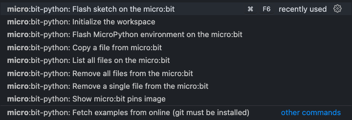

# micro:bit + MicroPython extension for VSCode

Met deze extentie kan de microbit geprogrammeerd worden met micropython.

Om de commando's voor de extensie te zien, gebruik je het commandopalet (**Windows / Linux**: `CTRL + Shift + P`, **Mac**: `⌘ + Shift + P`) en zoek je naar `micro:bit -python`. U ziet de volgende lijst.

Een uitgebreide uitleg vind je als je op de extentie klikt.
Hieronder de belangrijkste info.

---

## Getting started
Raadpleeg [deze link](https://youtu.be/eSGJLu1kqyg) voor een video-tutorial over het gebruik van deze extensie.

1. [Download en installeer](https://www.python.org/downloads/) python op uw systeem, bij voorkeur python3.
   
2. Open VSCode en installeer de [micro:bit python-extensie](https://marketplace.visualstudio.com/items?itemName=MAKinteract.micro-bit-python)
3. Sluit de micro:bit aan via een USB-kabel (zorg ervoor dat je kabel gegevensoverdracht mogelijk maakt en dat het niet alleen een oplaadkabel is)
4. Voer de eerste keer de opdracht `micro:bit-python: Flash MicroPython-omgeving op micro:bit` uit

* Bij elke oefening moet de microbit-map aanwezig zijn in de oefeningen-map. Deze map bevat alle modules die nodig zijn. Als dit nog niet aanwezig is, kan je dit doen met onderstaand commando:
`micro:bit-python: Initialize the workspace` uit. Kies de lege code.

* Upload je bestanden naar de micro:bit met het commando `micro:bit-python: Flash sketch on the micro:bit`. 
  * er moet altijd een main.py bestand aanwezig zijn in de map.